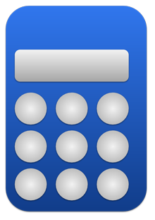

# Calculator - Earthquake Precursors Data Conversion Framework

This service is part of our [Earthquake Data Assimilation System](https://github.com/encresearch/data-assimilation-system).

## API Overview

Calculator works using MQTT, specifically Python's paho-mqtt module. Upon recieving an MQTT message from connector telling it what new data has been added to influxdb, Calculator will go in and convert the data correctly. It interprets which data is which based on the `adc` and `channel` tags that are given to the data in connector.

Calculator then adds the data back into new measurements in influxdb based on their location and sensor.

Finally, Calculator sends an MQTT message to inspector -- letting inspector know what new converted data needs to be inspected.

## Getting Started
These instructions are to get notifier up and running in your local development environment.

Pending.

### Install and Run Locally

Pending.

**Run Locally**

Pending.

**Run Local Tests**

Pending.

## Contributing
Pull requests and stars are always welcome. To contribute, please fetch, create an issue explaining the bug or feature request, create a branch off this issue and submit a pull request.
